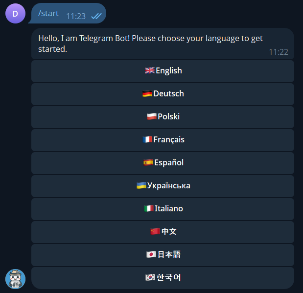

# Telegram Bot Multi-language Support

This is a small and simple module that allows you to add multi-language support to your Telegram bot using JSON.

It was originally created as part of a personal project, but I decided to share it separately — maybe it will be helpful to someone who wants to make their bot multilingual.

## 🧠 What it does

- Lets users select a language via `/start`
- Stores translations in a `translations.json` file
- Automatically replies with messages in the selected language

## Screenshot:

## 🛠 How to use

1. Copy the `translations.json` file to your project
2. Load translations using Python’s `json` module
3. Use `user_language` to select the right string from the file
4. Done — your bot now speaks many languages!
